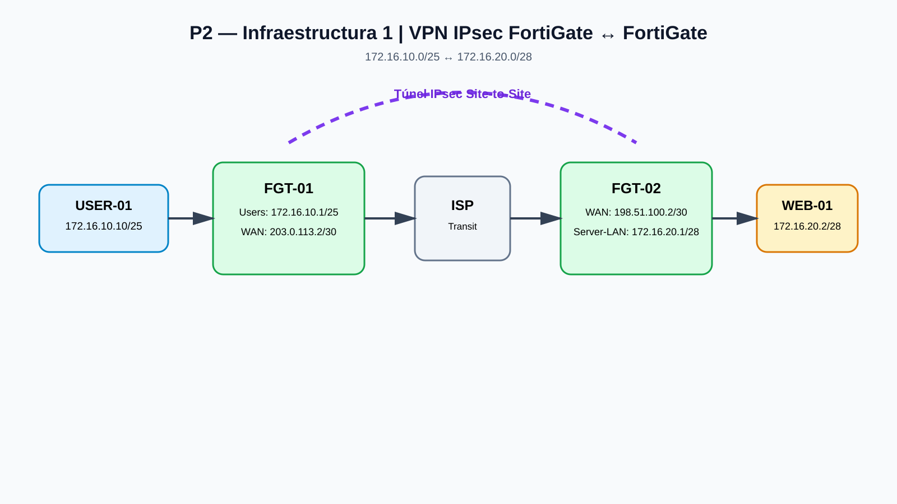

# Infraestructura 1 — VPN IPsec FortiGate ↔ FortiGate

**Video:** https://youtu.be/kekI346Hsyw

## 1. Objetivo

Establecer comunicación segura entre una red de usuarios y una red de servidores mediante un túnel IPsec site-to-site entre dos FortiGate. El escenario incorpora conectividad LAN, routing, NAT para tráfico externo y una política específica para el tráfico protegido por VPN.

## 2. Topología

## 3. Direccionamiento

| Equipo / segmento | Dirección | Función |
|---|---|---|
| USER-01 | 172.16.10.10/25 | Cliente de prueba |
| FGT-01 Users | 172.16.10.1/25 | Gateway de usuarios |
| FGT-01 WAN | 203.0.113.2/30 | Peer WAN |
| ISP lado FGT-01 | 203.0.113.1/30 | Gateway WAN |
| ISP lado FGT-02 | 198.51.100.1/30 | Gateway WAN |
| FGT-02 WAN | 198.51.100.2/30 | Peer WAN |
| FGT-02 Server-LAN | 172.16.20.1/28 | Gateway de servidores |
| WEB-01 | 172.16.20.2/28 | Servidor HTTPS |

## 4. VPN IPsec

- Tipo: Site-to-Site IPsec.
- Red local: 172.16.10.0/25.
- Red remota: 172.16.20.0/28.
- Peer: FGT-01 ↔ FGT-02.
- PSK configurada en ambos extremos; el secreto se omite.

## 5. Políticas y NAT

El tráfico que atraviesa la VPN se mantiene sin NAT para conservar las direcciones originales de las redes protegidas. El NAT se reserva para el tráfico que necesita traducción hacia redes externas.

## 6. Servicio

WEB-01 publica HTTPS sobre TCP/443.

## 7. Validaciones

Las evidencias del laboratorio registran:

- Túnel IPsec establecido.
- Comunicación USER-01 → WEB-01 mediante ICMP.
- Acceso HTTPS al servidor.
- Verificación de routing y NAT.
- Capturas de configuración, estado de VPN y pruebas.

## 8. Resultado

La Infraestructura 1 demuestra el escenario base del proyecto: dos FortiGate interconectados por IPsec, con una red de usuarios en un extremo y una red de servidores en el otro.
